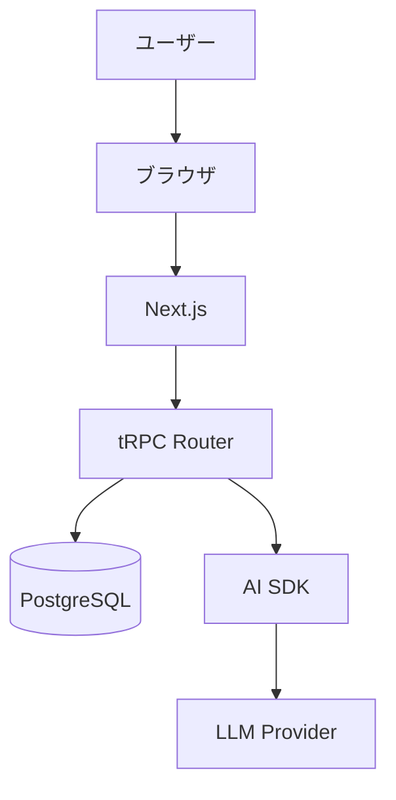

# Inkmaid プロジェクト改善提案

このドキュメントでは、プロジェクトをより良くするための改善提案をまとめています。

---

## 1. 開発体験（DX）の改善

### 1.1 カスタムスラッシュコマンドの活用

Claude Code用のカスタムコマンドを作成しました（`.claude/commands/`）：

| コマンド | 説明 | 使い方 |
|---------|------|--------|
| `/log` | 開発ログを自動生成 | 作業終了時に実行 |
| `/review` | コミット前のコードレビュー | コミット前に実行 |
| `/fix-types` | TypeScript型エラーを修正 | 型エラー発生時に実行 |
| `/db-change` | DBスキーマ変更手順をガイド | スキーマ変更時に実行 |
| `/test-feature` | テストケースを提案 | 新機能実装後に実行 |
| `/architecture` | アーキテクチャを説明 | プロジェクト理解時に実行 |

**次のステップ:**
- 使用頻度に応じてコマンドを追加・改善
- チーム固有のワークフローに合わせたカスタマイズ

### 1.2 開発環境の最適化

#### VS Code 拡張機能の推奨

`.vscode/extensions.json` を作成し、推奨拡張機能を定義:

```json
{
  "recommendations": [
    "biomejs.biome",
    "bradlc.vscode-tailwindcss",
    "dbaeumer.vscode-eslint",
    "esbenp.prettier-vscode",
    "Prisma.prisma",
    "ms-azuretools.vscode-docker"
  ]
}
```

#### VS Code 設定の統一

`.vscode/settings.json` でチーム全体の設定を統一:

```json
{
  "editor.formatOnSave": true,
  "editor.defaultFormatter": "biomejs.biome",
  "editor.codeActionsOnSave": {
    "quickfix.biome": "explicit",
    "source.organizeImports.biome": "explicit"
  },
  "[typescript]": {
    "editor.defaultFormatter": "biomejs.biome"
  },
  "[typescriptreact]": {
    "editor.defaultFormatter": "biomejs.biome"
  }
}
```

### 1.3 Git Hooks の導入

Huskyを使用してコミット前の自動チェック:

```bash
pnpm add -D husky lint-staged

# package.json
{
  "lint-staged": {
    "*.{ts,tsx}": [
      "biome check --write",
      "vitest related --run"
    ]
  }
}
```

**メリット:**
- コミット前に自動でLintとテストを実行
- 品質の低いコードがリポジトリに混入するのを防ぐ

---

## 2. コード品質の向上

### 2.1 TypeScript 厳格化

`tsconfig.json` の設定を強化:

```json
{
  "compilerOptions": {
    "strict": true,
    "noUncheckedIndexedAccess": true,
    "noImplicitReturns": true,
    "noFallthroughCasesInSwitch": true,
    "noUnusedLocals": true,
    "noUnusedParameters": true,
    "exactOptionalPropertyTypes": true
  }
}
```

### 2.2 コードカバレッジの目標設定

Vitestでカバレッジを計測:

```bash
pnpm test -- --coverage
```

**目標:**
- 重要なビジネスロジック: 80%以上
- ユーティリティ関数: 90%以上
- UIコンポーネント: 60%以上

### 2.3 コードレビューのチェックリスト

PR作成時のテンプレートを `.github/pull_request_template.md` に作成:

```markdown
## 変更内容

## チェックリスト

- [ ] Lint/Formatチェックをパス
- [ ] すべてのテストがパス
- [ ] 新機能にテストを追加
- [ ] ドキュメントを更新
- [ ] 開発ログを更新
- [ ] 型安全性を確保（`any`を使用していない）
```

---

## 3. パフォーマンス最適化

### 3.1 画像最適化

現在の実装状況を確認し、未対応の箇所を修正:

```tsx
// ❌ Before


// ✅ After
import Image from "next/image"
<Image src="/diagram.png" width={800} height={600} alt="図" />
```

### 3.2 バンドルサイズの監視

`@next/bundle-analyzer` を導入:

```bash
pnpm add -D @next/bundle-analyzer
```

```javascript
// next.config.js
const withBundleAnalyzer = require('@next/bundle-analyzer')({
  enabled: process.env.ANALYZE === 'true',
})

module.exports = withBundleAnalyzer({
  // existing config
})
```

**使い方:**
```bash
ANALYZE=true pnpm build
```

### 3.3 データベースクエリの最適化

#### クエリの分析

PostgreSQLの `EXPLAIN ANALYZE` を活用:

```typescript
// 開発時にクエリプランを確認
const result = await db.execute(sql`
  EXPLAIN ANALYZE
  SELECT * FROM projects WHERE user_id = ${userId}
`)
```

#### インデックスの追加

頻繁に検索されるカラムにインデックス:

```typescript
export const projects = pgTable("projects", {
  id: uuid("id").defaultRandom().primaryKey(),
  userId: uuid("user_id").notNull(),
  name: varchar("name", { length: 255 }).notNull(),
  createdAt: timestamp("created_at").defaultNow().notNull(),
}, (table) => ({
  userIdIdx: index("user_id_idx").on(table.userId),
  nameIdx: index("name_idx").on(table.name),
  createdAtIdx: index("created_at_idx").on(table.createdAt),
}))
```

### 3.4 React コンポーネントの最適化

#### メモ化の活用

```tsx
import { memo, useMemo, useCallback } from "react"

// コンポーネントのメモ化
export const ExpensiveComponent = memo(({ data }) => {
  // 重い計算のメモ化
  const processedData = useMemo(() => {
    return heavyComputation(data)
  }, [data])

  // 関数のメモ化
  const handleClick = useCallback(() => {
    // 処理
  }, [])

  return <div onClick={handleClick}>{processedData}</div>
})
```

#### 動的インポート

```tsx
import dynamic from "next/dynamic"

// 重いコンポーネントを遅延ロード
const MermaidViewer = dynamic(() => import("@/components/diagram/MermaidViewer"), {
  loading: () => <div>読み込み中...</div>,
  ssr: false,
})
```

---

## 4. セキュリティ強化

### 4.1 環境変数の厳格な管理

Zodで環境変数をバリデーション:

```typescript
// lib/env.ts
import { z } from "zod"

const envSchema = z.object({
  DATABASE_URL: z.string().url(),
  AI_PROVIDER: z.enum(["openai", "google", "anthropic"]),
  ANTHROPIC_API_KEY: z.string().min(1).optional(),
  OPENAI_API_KEY: z.string().min(1).optional(),
  GOOGLE_GENERATIVE_AI_API_KEY: z.string().min(1).optional(),
})

export const env = envSchema.parse(process.env)
```

### 4.2 レート制限の実装

APIエンドポイントにレート制限を追加:

```typescript
import rateLimit from "express-rate-limit"

const limiter = rateLimit({
  windowMs: 15 * 60 * 1000, // 15分
  max: 100, // 最大100リクエスト
  message: "リクエストが多すぎます。しばらく待ってから再試行してください。",
})

// tRPCミドルウェアで実装
```

### 4.3 CSP（Content Security Policy）の設定

`next.config.js` にセキュリティヘッダーを追加:

```javascript
module.exports = {
  async headers() {
    return [
      {
        source: "/:path*",
        headers: [
          {
            key: "Content-Security-Policy",
            value: "default-src 'self'; script-src 'self' 'unsafe-eval' 'unsafe-inline'; style-src 'self' 'unsafe-inline';",
          },
          {
            key: "X-Frame-Options",
            value: "DENY",
          },
          {
            key: "X-Content-Type-Options",
            value: "nosniff",
          },
        ],
      },
    ]
  },
}
```

### 4.4 依存関係の脆弱性スキャン

定期的な脆弱性チェック:

```bash
# npm audit
pnpm audit

# Snykの導入（推奨）
pnpm add -D snyk
pnpm snyk test
```

---

## 5. テスト戦略の強化

### 5.1 E2Eテストの導入

Playwrightを使用したE2Eテスト:

```bash
pnpm add -D @playwright/test
```

```typescript
// e2e/diagram-creation.spec.ts
import { test, expect } from "@playwright/test"

test("手書きで図を作成できる", async ({ page }) => {
  await page.goto("http://localhost:3000")

  // プロジェクト作成
  await page.click('button:has-text("新規プロジェクト")')
  await page.fill('input[name="name"]', "テストプロジェクト")
  await page.click('button:has-text("作成")')

  // キャンバスに描画
  const canvas = page.locator("canvas")
  await canvas.click({ position: { x: 100, y: 100 } })

  // Mermaidコードが生成されることを確認
  await expect(page.locator(".mermaid-code")).toBeVisible()
})
```

### 5.2 統合テストの追加

tRPCエンドポイントのテスト:

```typescript
// tests/trpc/diagram.test.ts
import { describe, it, expect, beforeEach } from "vitest"
import { appRouter } from "@/server/trpc/routers"

describe("diagram router", () => {
  let caller: ReturnType<typeof appRouter.createCaller>

  beforeEach(() => {
    caller = appRouter.createCaller({
      db: testDb,
      session: null,
    })
  })

  it("プロジェクトを作成できる", async () => {
    const result = await caller.diagram.create({
      name: "テストプロジェクト",
    })

    expect(result.id).toBeDefined()
    expect(result.name).toBe("テストプロジェクト")
  })
})
```

### 5.3 ビジュアルリグレッションテスト

Percy または Chromatic を使用:

```bash
pnpm add -D @percy/cli @percy/playwright
```

```typescript
import percySnapshot from "@percy/playwright"

test("UIスナップショット", async ({ page }) => {
  await page.goto("http://localhost:3000")
  await percySnapshot(page, "Home Page")
})
```

---

## 6. CI/CDパイプラインの構築

### 6.1 GitHub Actionsの設定

`.github/workflows/ci.yml`:

```yaml
name: CI

on:
  push:
    branches: [main, develop]
  pull_request:
    branches: [main, develop]

jobs:
  lint:
    runs-on: ubuntu-latest
    steps:
      - uses: actions/checkout@v3
      - uses: pnpm/action-setup@v2
        with:
          version: 9.15.1
      - uses: actions/setup-node@v3
        with:
          node-version: '20'
          cache: 'pnpm'
      - run: pnpm install
      - run: pnpm lint

  test:
    runs-on: ubuntu-latest
    services:
      postgres:
        image: postgres:16
        env:
          POSTGRES_PASSWORD: postgres
        options: >-
          --health-cmd pg_isready
          --health-interval 10s
          --health-timeout 5s
          --health-retries 5
    steps:
      - uses: actions/checkout@v3
      - uses: pnpm/action-setup@v2
      - uses: actions/setup-node@v3
        with:
          node-version: '20'
          cache: 'pnpm'
      - run: pnpm install
      - run: pnpm test

  build:
    runs-on: ubuntu-latest
    steps:
      - uses: actions/checkout@v3
      - uses: pnpm/action-setup@v2
      - uses: actions/setup-node@v3
        with:
          node-version: '20'
          cache: 'pnpm'
      - run: pnpm install
      - run: pnpm build
```

### 6.2 自動デプロイ

Vercelへの自動デプロイ設定:

1. Vercelプロジェクトを作成
2. GitHubリポジトリを接続
3. 環境変数を設定
4. mainブランチへのマージで自動デプロイ

---

## 7. モニタリングとロギング

### 7.1 エラー監視

Sentryの導入:

```bash
pnpm add @sentry/nextjs
```

```typescript
// sentry.client.config.ts
import * as Sentry from "@sentry/nextjs"

Sentry.init({
  dsn: process.env.NEXT_PUBLIC_SENTRY_DSN,
  tracesSampleRate: 1.0,
  environment: process.env.NODE_ENV,
})
```

### 7.2 パフォーマンス監視

Web Vitalsの計測:

```typescript
// app/layout.tsx
import { Analytics } from "@vercel/analytics/react"
import { SpeedInsights } from "@vercel/speed-insights/next"

export default function RootLayout({ children }) {
  return (
    <html>
      <body>
        {children}
        <Analytics />
        <SpeedInsights />
      </body>
    </html>
  )
}
```

### 7.3 ロギング戦略

構造化ログの実装:

```typescript
// lib/logger.ts
import pino from "pino"

export const logger = pino({
  level: process.env.LOG_LEVEL || "info",
  formatters: {
    level: (label) => {
      return { level: label }
    },
  },
})

// 使用例
logger.info({ userId: "123", action: "create_project" }, "プロジェクトを作成")
logger.error({ error: err }, "プロジェクト作成に失敗")
```

---

## 8. ドキュメントの充実

### 8.1 Storybookの導入

コンポーネントカタログの作成:

```bash
pnpm add -D @storybook/react @storybook/nextjs
```

```typescript
// stories/Button.stories.tsx
import type { Meta, StoryObj } from "@storybook/react"
import { Button } from "@/components/ui/Button"

const meta: Meta<typeof Button> = {
  title: "UI/Button",
  component: Button,
}

export default meta
type Story = StoryObj<typeof Button>

export const Primary: Story = {
  args: {
    variant: "primary",
    children: "ボタン",
  },
}
```

### 8.2 APIドキュメントの自動生成

tRPCのOpenAPI出力:

```bash
pnpm add trpc-openapi
```

```typescript
import { generateOpenApiDocument } from "trpc-openapi"
import { appRouter } from "./server/trpc/routers"

const openApiDocument = generateOpenApiDocument(appRouter, {
  title: "Inkmaid API",
  version: "1.0.0",
  baseUrl: "http://localhost:3000/api",
})
```

### 8.3 アーキテクチャ図の作成

Mermaidを使用したドキュメント:



---

## 9. ユーザビリティの改善

### 9.1 アクセシビリティ対応

- WAI-ARIA属性の追加
- キーボード操作のサポート
- スクリーンリーダー対応
- カラーコントラストの確保

```tsx
<button
  aria-label="プロジェクトを削除"
  aria-describedby="delete-warning"
  onClick={handleDelete}
>
  削除
</button>
<div id="delete-warning" className="sr-only">
  この操作は取り消せません
</div>
```

### 9.2 国際化（i18n）対応

next-intlの導入（将来的に多言語対応する場合）:

```bash
pnpm add next-intl
```

### 9.3 Progressive Web App (PWA)

next-pwaの導入:

```bash
pnpm add next-pwa
```

---

## 10. 優先順位と実装計画

### 高優先度（すぐに実施すべき）

1. ✅ **Claude Code用ドキュメントの作成** - 完了
2. ✅ **カスタムスラッシュコマンドの作成** - 完了
3. Git Hooksの導入（Husky + lint-staged）
4. TypeScript設定の厳格化
5. 基本的なE2Eテストの追加

### 中優先度（次のフェーズで実施）

6. CI/CDパイプラインの構築
7. エラー監視（Sentry）の導入
8. パフォーマンス最適化（画像、バンドルサイズ）
9. セキュリティ強化（CSP、レート制限）
10. コードカバレッジの向上

### 低優先度（将来的に実施）

11. Storybookの導入
12. ビジュアルリグレッションテスト
13. 国際化対応
14. PWA対応
15. アクセシビリティ監査

---

## まとめ

このドキュメントで提案した改善策は、以下の目標に貢献します：

1. **開発効率の向上** - 自動化とツール活用
2. **コード品質の向上** - Lint、テスト、レビュー
3. **パフォーマンス最適化** - ユーザー体験の向上
4. **セキュリティ強化** - 安全なアプリケーション
5. **保守性の向上** - ドキュメント、監視、ログ

優先順位に従って段階的に実装していくことをお勧めします。
