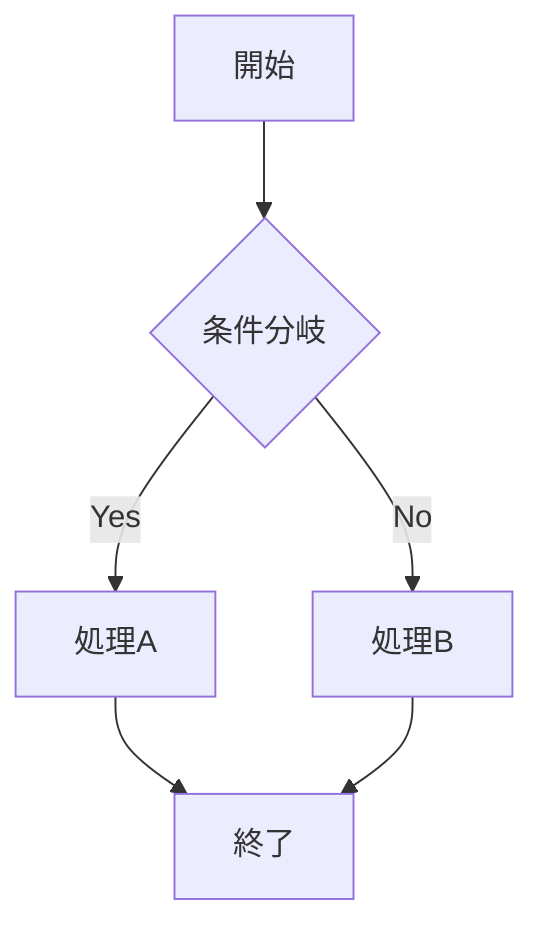

# 開発ログ: 2025-12-21 (2)

## 概要

Phase 2 のコア機能として、以下を実装：
1. 手書きCanvas（Konva.js）の実装
2. サイドバーレイアウトへの変更
3. **Mermaid.js によるダイアグラム描画（SVGレイヤー）の追加**
4. **ハイブリッド・キャンバス構造の完成**

---

## 1. react-konva パッケージのインストール

### 追加したパッケージ

```bash
pnpm add konva react-konva --filter web
```

- `konva`: Canvas描画ライブラリ
- `react-konva`: React用のKonvaバインディング

---

## 2. HandwritingCanvas コンポーネントの作成

### 作成したファイル

- `apps/web/src/components/HandwritingCanvas.tsx` - 手書きCanvasのメインコンポーネント
- `apps/web/src/components/DynamicHandwritingCanvas.tsx` - SSR対応のラッパー

### HandwritingCanvas の機能

| 機能 | 説明 |
|------|------|
| 手書き描画 | マウス/タッチで自由に描画 |
| Undo | 最後のストロークを取り消し |
| クリア | 全ストロークを消去 |
| ストローク数表示 | 現在のストローク数を表示 |
| コールバック | ストローク完了時にデータを親に通知 |

### Stroke 型定義

```typescript
export type Stroke = {
  id: string;           // ストロークのユニークID
  points: number[];     // 座標データ [x1, y1, x2, y2, ...]
  color: string;        // ストロークの色
  strokeWidth: number;  // ストロークの太さ
};
```

### SSR対応

Konva.jsはSSR非対応のため、`next/dynamic` を使用してクライアントサイドでのみ読み込むラッパーを作成。

```typescript
const DynamicHandwritingCanvas = dynamic(
  () => import("./HandwritingCanvas"),
  { ssr: false }
);
```

---

## 3. レイアウトの変更

### Before（縦並びレイアウト）

- ヘッダー
- 手書きキャンバス（800×400）
- プロジェクト作成フォーム + プロジェクト一覧（2カラム）

### After（サイドバーレイアウト）

```
┌──────────────┬─────────────────────────────────┐
│  サイドバー   │  メインエリア                    │
│  (w-72)      │                                 │
│              │  ┌─────────────────────────────┐│
│  ロゴ        │  │ ヘッダー                     ││
│              │  ├─────────────────────────────┤│
│  新規作成    │  │                             ││
│              │  │   手書きキャンバス            ││
│  プロジェクト │  │   (1400×700)                ││
│  一覧        │  │                             ││
│              │  │                             ││
│              │  └─────────────────────────────┘│
└──────────────┴─────────────────────────────────┘
```

### キャンバスサイズの変遷

| 段階 | サイズ |
|------|--------|
| 初期 | 800×400 |
| 拡大1 | 1100×500 |
| 最終 | 1400×700 |

---

## 4. CSS修正

### Tailwind CSS 4 対応

- `bg-gradient-to-br` → `bg-linear-to-br`
- `bg-gradient-to-r` → `bg-linear-to-r`

Tailwind CSS 4 では gradient の構文が変更された。

---

## 5. Mermaid.js によるダイアグラム描画

### 追加したパッケージ

```bash
pnpm add mermaid --filter web
```

### 作成したファイル

| ファイル | 説明 |
|---------|------|
| `MermaidPreview.tsx` | Mermaid.jsでダイアグラムをSVGとしてレンダリング |
| `DynamicMermaidPreview.tsx` | SSR対応ラッパー |
| `DiagramCanvas.tsx` | ハイブリッドキャンバス（Mermaid + 手書き） |
| `DynamicDiagramCanvas.tsx` | SSR対応ラッパー |

### MermaidPreview の機能

| 機能 | 説明 |
|------|------|
| SVGレンダリング | Mermaidコードからダイアグラムを描画 |
| エラーハンドリング | 構文エラー時にメッセージ表示 |
| 動的更新 | コード変更時に自動再描画 |

---

## 6. ハイブリッド・キャンバス構造

設計ドキュメントに従い、2層のレイヤー構造を実装。

```
┌─────────────────────────────────────────────────┐
│  上層: HandwritingCanvas (Konva.js)              │
│  - マウス/タッチで手書き入力                       │
│  - 透明背景で下層が透過                           │
├─────────────────────────────────────────────────┤
│  下層: MermaidPreview (SVG)                      │
│  - Mermaidコードからダイアグラムを描画             │
│  - pointer-events: none で入力を上層に通過        │
└─────────────────────────────────────────────────┘
```

### DiagramCanvas の構成

```typescript
<div className="relative">
  {/* 下層: Mermaid SVG レイヤー */}
  <div className="absolute inset-0 pointer-events-none">
    <DynamicMermaidPreview ... />
  </div>

  {/* 上層: 手書きレイヤー */}
  <div className="absolute inset-0">
    <DynamicHandwritingCanvas ... />
  </div>
</div>
```

### 修正ポイント

HandwritingCanvasの背景を透明化：
```typescript
// Before
backgroundColor: "#fefefe"

// After
backgroundColor: "transparent"
```

---

## 7. Mermaidコードエディタ

DiagramCanvasにMermaidコードの表示・編集機能を追加。

| 機能 | 説明 |
|------|------|
| コード表示 | 現在のMermaidコードをプレビュー |
| 編集モード | テキストエリアで直接編集可能 |
| 適用/キャンセル | 編集内容を適用または破棄 |

### サンプルコード



---

## 8. 現在のファイル構成

```
apps/web/src/
├── app/
│   ├── page.tsx              # メインページ（ハイブリッドキャンバス統合）
│   ├── layout.tsx
│   ├── globals.css
│   └── api/trpc/[trpc]/route.ts
├── components/
│   ├── HandwritingCanvas.tsx       # 手書きCanvas
│   ├── DynamicHandwritingCanvas.tsx
│   ├── MermaidPreview.tsx          # Mermaid描画（NEW）
│   ├── DynamicMermaidPreview.tsx   # SSRラッパー（NEW）
│   ├── DiagramCanvas.tsx           # ハイブリッドキャンバス（NEW）
│   └── DynamicDiagramCanvas.tsx    # SSRラッパー（NEW）
├── lib/trpc/
│   ├── client.ts
│   └── provider.tsx
└── server/
    ├── db/
    │   ├── schema.ts
    │   └── index.ts
    └── trpc/
        ├── init.ts
        └── routers/
            ├── diagram.ts
            └── index.ts
```

---

## 次のステップ

- [x] ~~Mermaid.js によるダイアグラム描画（SVGレイヤーの追加）~~
- [ ] ストロークデータの DB保存（handwriting_strokes テーブル）
- [ ] 色・太さ選択の UIツールバー追加
- [ ] Vercel AI SDK による AIチャットボットの実装
- [ ] 手書きストロークからAIへの送信機能

---

## コマンド

```bash
# 開発サーバー起動
pnpm dev:all

# http://localhost:3000 または http://localhost:3002 でアクセス
```

---

## 参考

- 設計ドキュメント: `doc/develop.md`
- 前回のログ: `doc/logs/20251221.md`

