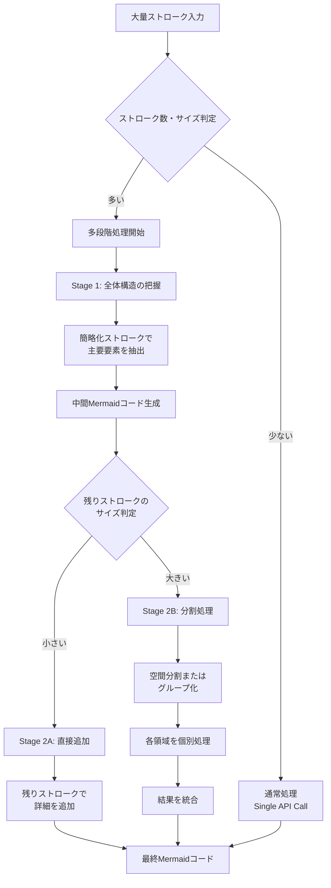

# 大量ストローク処理の多段階処理設計

## 概要

大量の手書きストロークを処理する際、単一のAPI呼び出しではデータサイズ制限や処理精度の問題が発生する可能性があります。本設計では、**階層的2段階処理（Hierarchical Two-Stage Processing）**と**空間分割統治（Spatial Divide and Conquer）**を組み合わせたハイブリッドアプローチを採用し、段階的に品質を向上させながら大量のストロークを処理します。

## 設計目標

1. **データサイズ制限の回避**: リクエストボディサイズ制限（900KB）を超えるストロークでも処理可能にする
2. **処理精度の向上**: 段階的に処理することで、全体構造と詳細の両方を適切に解釈する
3. **ユーザー体験の向上**: 処理の進捗を可視化し、段階的な改善をユーザーに提示する
4. **コスト最適化**: 必要最小限のAPI呼び出しで最大の効果を得る

## アーキテクチャ概要



## 処理フロー詳細

### Phase 1: 判定フェーズ

**判定基準:**
- ストローク数: `strokes.length > THRESHOLD_STROKE_COUNT` (デフォルト: 50)
- データサイズ: `estimateStrokeDataSize(strokes) > THRESHOLD_SIZE` (デフォルト: 900KB)

**判定ロジック:**
```typescript
function shouldUseMultiStageProcessing(strokes: Stroke[]): boolean {
  const strokeCount = strokes.length;
  const dataSize = estimateStrokeDataSize(strokes);

  return strokeCount > THRESHOLD_STROKE_COUNT ||
         dataSize > THRESHOLD_SIZE;
}
```

### Phase 2: Stage 1 - 全体構造の把握

**目的:** 大量のストロークから主要な構造（ノード、主要な接続）を抽出する

**処理内容:**
1. **ストロークの簡略化**
   - 許容誤差: 3.0px（Stage 1は粗めに）
   - 最大points数: 300 points/ストローク
   - 目的: データサイズを削減し、主要な形状を抽出

2. **プロンプト設計**
   ```
   あなたは手書きストロークからMermaidダイアグラムの全体構造を把握するAIアシスタントです。

   ## タスク
   - 提供されたストロークから、**主要な要素（ノード、接続）**を抽出してください
   - 詳細な装飾や細かい要素は無視し、全体の骨格構造に集中してください
   - 不完全な情報でも構いません。全体の流れや構造を優先してください

   ## 出力形式
   ---MERMAID_START---
   (主要な構造のみのMermaidコード)
   ---MERMAID_END---

   ---REASON_START---
   (抽出した主要要素の説明)
   ---REASON_END---
   ```

3. **出力**
   - 中間Mermaidコード（主要構造のみ）
   - 抽出した要素の説明
   - 処理したストロークのインデックス範囲

**API呼び出し:**
```typescript
const stage1Result = await interpretStrokes({
  strokes: simplifiedStrokes, // 簡略化済み
  currentMermaidCode: initialMermaidCode,
  nodePositions: [],
  diagramType,
  mode: "structure-extraction", // 新しいパラメータ
});
```

### Phase 3: Stage 2 - 詳細の追加

Stage 1で生成されたMermaidコードをベースに、残りのストロークで詳細を追加します。

#### Stage 2A: 直接追加（残りストロークが少ない場合）

**条件:** 残りストロークのデータサイズが閾値以下

**処理内容:**
1. Stage 1で処理されなかったストロークを抽出
2. Stage 1の結果を`currentMermaidCode`として使用
3. 残りストロークで詳細を追加

**プロンプト設計:**
```
既存のMermaidコードに、追加のストロークで詳細を追加してください。

## 既存のMermaidコード（主要構造）
```mermaid
{stage1MermaidCode}
```

## 追加のストローク
{remainingStrokes}

## タスク
- 既存の構造を保持しつつ、追加ストロークで詳細を追加してください
- 新しいノード、接続、ラベル、スタイルなどを追加できます
- 既存の要素を修正・削除することも可能です
```

#### Stage 2B: 分割処理（残りストロークが多い場合）

**条件:** 残りストロークのデータサイズが閾値超過

**処理内容:**
1. **空間分割またはグループ化**
   - オプションA: 空間的グリッド分割（キャンバスをN×Mのグリッドに分割）
   - オプションB: クラスタリング（近接するストロークをグループ化）
   - オプションC: 時間的順序分割（描画順序で分割）

2. **各領域/グループの処理**
   - 各領域/グループを個別にAPI呼び出し
   - 前回のMermaidコードを`currentMermaidCode`として使用
   - 並列処理可能（ただし、順次処理の方が安全）

3. **結果の統合**
   - 各領域の結果をマージ
   - 境界の接続を検出・追加
   - 重複する要素を統合

**空間分割の実装例:**
```typescript
function divideStrokesBySpace(
  strokes: Stroke[],
  gridSize: { cols: number; rows: number },
  canvasSize: { width: number; height: number }
): Stroke[][] {
  const grid: Stroke[][] = Array(gridSize.cols * gridSize.rows)
    .fill(null)
    .map(() => []);

  strokes.forEach(stroke => {
    const bounds = getStrokeBounds(stroke.points);
    const centerX = bounds.centerX;
    const centerY = bounds.centerY;

    const col = Math.floor((centerX / canvasSize.width) * gridSize.cols);
    const row = Math.floor((centerY / canvasSize.height) * gridSize.rows);
    const index = row * gridSize.cols + col;

    grid[index]?.push(stroke);
  });

  return grid.filter(group => group.length > 0);
}
```

**統合処理:**
```typescript
async function mergeMermaidResults(
  baseCode: string,
  regionResults: Array<{ mermaidCode: string; strokes: Stroke[] }>
): Promise<string> {
  // 1. 各領域の結果を順次マージ
  let mergedCode = baseCode;

  for (const result of regionResults) {
    mergedCode = await mergeMermaidCode(mergedCode, result.mermaidCode);
  }

  // 2. 境界の接続を検出
  const boundaryConnections = detectBoundaryConnections(regionResults);
  mergedCode = addConnections(mergedCode, boundaryConnections);

  // 3. 重複要素の統合
  mergedCode = deduplicateElements(mergedCode);

  return mergedCode;
}
```

## データ構造

### 多段階処理の状態管理

```typescript
type MultiStageProcessingState = {
  stage: "idle" | "stage1" | "stage2a" | "stage2b" | "completed" | "error";
  stage1Result: {
    mermaidCode: string;
    reason: string;
    processedStrokeIndices: number[];
  } | null;
  stage2Result: {
    mermaidCode: string;
    reason: string;
    processedRegions: Array<{
      regionId: string;
      mermaidCode: string;
      strokeCount: number;
    }>;
  } | null;
  progress: {
    current: number;
    total: number;
    message: string;
  };
  error: string | null;
};
```

### APIリクエスト/レスポンス

**拡張されたリクエスト:**
```typescript
interface InterpretStreamRequest {
  strokes: Stroke[];
  currentMermaidCode: string;
  nodePositions?: NodePosition[];
  canvasImage?: string;
  hint?: string;
  diagramType: DiagramType;
  // 新規追加
  mode?: "normal" | "structure-extraction" | "detail-addition";
  stage?: 1 | 2;
  baseMermaidCode?: string; // Stage 2で使用
  processedStrokeIndices?: number[]; // Stage 1で処理済みのインデックス
}
```

**拡張されたレスポンス:**
```typescript
interface InterpretStreamResponse {
  mermaidCode: string;
  reason: string;
  thinking: string;
  // 新規追加
  stage: 1 | 2;
  processedStrokeIndices?: number[]; // 処理したストロークのインデックス
  remainingStrokeCount?: number; // 残りのストローク数
  isComplete: boolean; // 処理が完了したか
}
```

## 実装の詳細

### 1. クライアント側の実装

**新しいフック: `useMultiStageAIStream`**

```typescript
export function useMultiStageAIStream() {
  const [state, setState] = useState<MultiStageProcessingState>({
    stage: "idle",
    stage1Result: null,
    stage2Result: null,
    progress: { current: 0, total: 0, message: "" },
    error: null,
  });

  const processStrokes = async (
    params: InterpretParams,
    onComplete: (result: { mermaidCode: string; reason: string }) => void
  ) => {
    // 判定フェーズ
    if (!shouldUseMultiStageProcessing(params.strokes)) {
      // 通常処理
      return await normalProcessing(params, onComplete);
    }

    // Stage 1
    setState(prev => ({ ...prev, stage: "stage1", progress: { current: 1, total: 2, message: "全体構造を解析中..." } }));
    const stage1Result = await processStage1(params);

    if (!stage1Result.mermaidCode) {
      setState(prev => ({ ...prev, stage: "error", error: "Stage 1でエラーが発生しました" }));
      return;
    }

    setState(prev => ({ ...prev, stage1Result: stage1Result }));

    // Stage 2
    const remainingStrokes = getRemainingStrokes(
      params.strokes,
      stage1Result.processedStrokeIndices
    );

    if (remainingStrokes.length === 0) {
      // Stage 1の結果で完了
      onComplete({ mermaidCode: stage1Result.mermaidCode, reason: stage1Result.reason });
      return;
    }

    if (isStrokeDataTooLarge(remainingStrokes)) {
      // Stage 2B: 分割処理
      setState(prev => ({ ...prev, stage: "stage2b", progress: { current: 2, total: 3, message: "詳細を追加中..." } }));
      const stage2Result = await processStage2B(stage1Result.mermaidCode, remainingStrokes, params);
      onComplete({ mermaidCode: stage2Result.mermaidCode, reason: stage2Result.reason });
    } else {
      // Stage 2A: 直接追加
      setState(prev => ({ ...prev, stage: "stage2a", progress: { current: 2, total: 2, message: "詳細を追加中..." } }));
      const stage2Result = await processStage2A(stage1Result.mermaidCode, remainingStrokes, params);
      onComplete({ mermaidCode: stage2Result.mermaidCode, reason: stage2Result.reason });
    }
  };

  return { state, processStrokes };
}
```

### 2. サーバー側の実装

**APIエンドポイントの拡張**

`apps/web/src/app/api/ai/interpret-stream/route.ts`を拡張:

```typescript
export async function POST(request: Request) {
  const body: InterpretStreamRequest = await request.json();
  const { mode = "normal", stage, baseMermaidCode, processedStrokeIndices } = body;

  // モードに応じたプロンプトを選択
  const systemPrompt = mode === "structure-extraction"
    ? getStructureExtractionPrompt(body.diagramType)
    : mode === "detail-addition"
    ? getDetailAdditionPrompt(body.diagramType, baseMermaidCode)
    : getStrokeInterpretationPrompt(body.diagramType);

  // ストロークのフィルタリング（Stage 2の場合）
  let strokesToProcess = body.strokes;
  if (stage === 2 && processedStrokeIndices) {
    strokesToProcess = body.strokes.filter(
      (_, index) => !processedStrokeIndices.includes(index)
    );
  }

  // 既存の処理ロジック...
}
```

### 3. プロンプトの設計

**構造抽出用プロンプト (`getStructureExtractionPrompt`)**

```typescript
function getStructureExtractionPrompt(diagramType: DiagramType): string {
  return `あなたは手書きストロークからMermaidダイアグラムの**全体構造**を把握するAIアシスタントです。

## 現在編集中の図の種類: ${diagramType}

## あなたの役割（Stage 1: 構造抽出）
- **主要な要素（ノード、接続）のみを抽出してください**
- 詳細な装飾、細かい要素、不完全なストロークは無視してください
- 全体の骨格構造、流れ、主要な関係性を優先してください
- 不完全な情報でも構いません。全体像を把握することが重要です

${DIAGRAM_SYNTAX_RULES[diagramType]}

## 出力形式
---MERMAID_START---
(主要な構造のみのMermaidコード)
---MERMAID_END---

---REASON_START---
(抽出した主要要素の説明: どのようなノードや接続を検出したか)
---REASON_END---

## 注意事項
- 詳細は後で追加されます。今は全体構造に集中してください
- 不完全でも構いません。主要な要素を優先してください`;
}
```

**詳細追加用プロンプト (`getDetailAdditionPrompt`)**

```typescript
function getDetailAdditionPrompt(
  diagramType: DiagramType,
  baseMermaidCode: string
): string {
  return `あなたは既存のMermaidダイアグラムに**詳細を追加**するAIアシスタントです。

## 現在編集中の図の種類: ${diagramType}

## 既存のMermaidコード（主要構造）
\`\`\`mermaid
${baseMermaidCode}
\`\`\`

## あなたの役割（Stage 2: 詳細追加）
- 既存の構造を**保持**しつつ、追加ストロークで詳細を追加してください
- 新しいノード、接続、ラベル、スタイルなどを追加できます
- 既存の要素を修正・削除することも可能です
- 追加ストロークの意図を推測し、適切に統合してください

${DIAGRAM_SYNTAX_RULES[diagramType]}

## 出力形式
---MERMAID_START---
(詳細を追加した完全なMermaidコード)
---MERMAID_END---

---REASON_START---
(追加した詳細の説明: 何を追加・修正したか)
---REASON_END---

## 注意事項
- 既存の構造を壊さないようにしてください
- 追加ストロークの意図を最大限に反映してください`;
}
```

## UI/UXの改善

### 進捗表示

**AIThinkingPanelの拡張:**

```typescript
// 多段階処理の進捗を表示
{multiStageState.stage !== "idle" && (
  <div className="mb-4 p-3 bg-violet-50 rounded-lg">
    <div className="flex items-center gap-2 mb-2">
      <div className="flex-1 bg-gray-200 rounded-full h-2">
        <div
          className="bg-violet-600 h-2 rounded-full transition-all"
          style={{
            width: `${(multiStageState.progress.current / multiStageState.progress.total) * 100}%`,
          }}
        />
      </div>
      <span className="text-xs text-violet-700">
        {multiStageState.progress.current}/{multiStageState.progress.total}
      </span>
    </div>
    <p className="text-sm text-violet-700">
      {multiStageState.progress.message}
    </p>
    {multiStageState.stage === "stage1" && (
      <p className="text-xs text-gray-500 mt-1">
        全体構造を解析中... 主要な要素を抽出しています
      </p>
    )}
    {multiStageState.stage === "stage2a" && (
      <p className="text-xs text-gray-500 mt-1">
        詳細を追加中... 既存の構造に詳細を統合しています
      </p>
    )}
    {multiStageState.stage === "stage2b" && (
      <p className="text-xs text-gray-500 mt-1">
        領域ごとに処理中... {multiStageState.stage2Result?.processedRegions.length || 0} 領域を処理
      </p>
    )}
  </div>
)}
```

## パラメータと設定

### 閾値設定

```typescript
// apps/web/src/lib/config/multiStageProcessing.ts
export const MULTI_STAGE_CONFIG = {
  // 判定閾値
  THRESHOLD_STROKE_COUNT: 50,
  THRESHOLD_SIZE_BYTES: 900 * 1024, // 900KB

  // Stage 1設定
  STAGE1_SIMPLIFICATION_TOLERANCE: 3.0,
  STAGE1_MAX_POINTS_PER_STROKE: 300,

  // Stage 2設定
  STAGE2_SIMPLIFICATION_TOLERANCE: 2.0,
  STAGE2_MAX_POINTS_PER_STROKE: 500,

  // 空間分割設定
  SPATIAL_DIVISION: {
    GRID_COLS: 3,
    GRID_ROWS: 3,
    MIN_STROKES_PER_REGION: 5,
  },

  // クラスタリング設定
  CLUSTERING: {
    DISTANCE_THRESHOLD: 100, // ピクセル
    MIN_CLUSTER_SIZE: 3,
  },
};
```

## エラーハンドリング

### エラーシナリオと対応

1. **Stage 1でエラー**
   - フォールバック: 通常処理に切り替え
   - ユーザーに通知: 「構造解析に失敗しました。通常処理で続行します」

2. **Stage 2でエラー**
   - フォールバック: Stage 1の結果を返す
   - ユーザーに通知: 「詳細の追加に失敗しました。主要構造のみ表示します」

3. **統合処理でエラー**
   - フォールバック: 最後に成功した領域の結果を返す
   - ユーザーに通知: 「一部の領域の統合に失敗しました」

## パフォーマンス考慮

### 最適化戦略

1. **並列処理**
   - Stage 2Bの各領域処理は理論上並列可能
   - ただし、Mermaidコードの統合が複雑になるため、順次処理を推奨

2. **キャッシュ**
   - Stage 1の結果をキャッシュし、Stage 2で再利用
   - 簡略化されたストロークをキャッシュ

3. **早期終了**
   - Stage 1の結果が十分な場合、Stage 2をスキップ可能
   - 残りストロークが少ない場合、簡略化をスキップ

## テスト戦略

### テストケース

1. **通常処理（閾値以下）**
   - ストローク数: 10個
   - 期待動作: 通常処理で1回のAPI呼び出し

2. **多段階処理（閾値超過）**
   - ストローク数: 100個
   - 期待動作: Stage 1 → Stage 2A/B

3. **大量ストローク（分割処理）**
   - ストローク数: 200個
   - 期待動作: Stage 1 → Stage 2B（分割処理）

4. **エラーケース**
   - Stage 1エラー時のフォールバック
   - Stage 2エラー時のフォールバック

## 今後の拡張

1. **3段階以上の処理**
   - より複雑な図に対応するため、3段階以上の処理を検討

2. **学習機能**
   - ユーザーの描画パターンを学習し、処理精度を向上

3. **インタラクティブな改善**
   - ユーザーが中間結果を確認し、次のステップを選択可能に

4. **並列処理の最適化**
   - 領域間の依存関係を分析し、並列処理を最適化

## 参考資料

- [ストローク簡略化の実装](./strokeSimplification.ts)
- [AI SDK使用ガイド](./ai-sdk-usage.md)
- [APIリファレンス](./api-reference.md)
